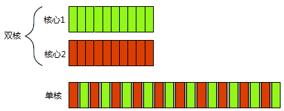
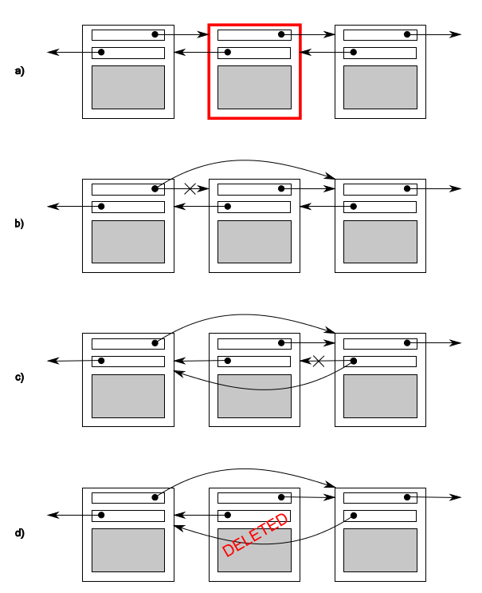

# 第1章 你好，并发世界!

## 1.1 何谓并发

### 计算机的并发

并发，指两个或两个以上的独立活动同时发生。计算机的并发，指在单个系统里同时执行多个独立的任务。

在一个双核机器上，每个任务可以在各自的处理核心上执行。在单核机器上做任务切换时，每个任务的块交替进行，但中间有一小段分隔(图中所示灰色分隔条)，这表示切换任务的开销。进行任务切换时，操作系统必须保存当前任务CPU的状态和指令指针，并计算要切换到哪个任务，再将切换到的任务加载处理器中。CPU可能要将新任务的指令和数据载入到缓存，这会让CPU停止执行指令，从而造成的更多的延迟。



图 1.1 并发的两种方式：真正并行 vs. 任务切换

图1.2显示了四个任务在双核处理器上的任务切换，仍是将任务整齐地划分为同等大小子任务块的理想情况。实际上，许多因素会使得任务分割不均或调度不规则。


图 1.2 四个任务在两个核心之间的切换

### 并发的方式

##### 多进程并发

使用并发的第一种方式，是将应用程序分为多个独立的进程同时运行，就像同时进行网页浏览和文字处理一样。独立的进程可以通过进程间的通信渠道传递讯息(信号、套接字、文件、管道等等)。

优点：

- 操作系统在进程间提供了保护和更高级别的通信机制，可以更容易编写安全的并发代码。
- 可以使用远程连接(可能需要联网)的方式，在不同的机器上运行独立的进程。

缺点：

- 进程间的通信通常非常复杂，或是速度很慢。这是因为操作系统会对进程进行保护，以避免一个进程去修改另一个进程的数据。
- 运行多个进程的固定开销较大：需要时间启动进程，操作系统需要资源来管理进程等等。


图 1.3 一对并发运行的进程之间的通信

##### 多线程并发

并发的另一个方式，在单进程中运行多个线程。线程很像轻量级的进程：每个线程相互独立运行，并且可以在不同的指令序列中运行。不过，进程中的所有线程都共享地址空间，并且能访问到大部分数据———全局变量仍然是全局的，指针、对象的引用或数据可以在线程之间传递。

优点：地址空间共享，以及缺少线程间的数据保护，使得操作系统记录的工作量减小，所以使用多线程的开销远远小于多进程。

缺点：共享内存的灵活性是有代价的：如果多个线程访问数据，那么必须确保每个线程所访问到的数据一致，这就需要对线程通信做大量的工作。


图 1.4 同一进程中，一对并发线程间的通信

>  本书只关注多线程的并发，之后所提到“并发”，均为多线程实现。多线程应用中，还有一种方式：并行。

### 并发与并行

这两个词是用来描述硬件同时执行多个任务的方式，而“并行”更加注重性能。使用硬件提高数据处理速度时，会讨论程序的并行性。当关注重点在于任务分离或任务响应时，会讨论程序的并发性。

## 1.2 为什么使用并发

原因有二：分离关注点(SOC)和性能

### 分离关注点

编写软件时，分离关注点是个好办法。通过将相关的代码与无关的代码分离，可以使程序更容易理解和测试，从而减少出错的可能。即使一些操作需要同时进行，依旧可以使用并发，分离不同的功能区域。

### 性能

有两种利用并发来提高性能的方式：第一，将一个单个任务分成几部分并行运行，从而降低总运行时间，这就是**任务并行**(task parallelism)。另一个线程执行算法的另一个部分——或是在处理数据——每个线程在不同的数据块上执行相同的操作(第二种方式)。后一种方法被称为**数据并行**(data parallelism)。

### 什么时候不使用并发

除非潜在的性能增益足够大或关注点分离地足够清晰，能抵消为确保正确开发所需的额外时间，以及维护代码的额外成本；否则，勿用并发。

启动线程时存在固有开销，因为操作系统需要分配内核资源和堆栈空间，才能把新线程加入调度器中。如果在线程上的任务完成得很快，那么实际执行任务的时间要比启动线程的时间小很多，这会导致应用的整体性能不如直接使用单线程。

此外，线程的资源有限。如果太多的线程同时运行，则会消耗很多操作系统资源，从而使得操作系统整体上运行得更加缓慢。

但当用于需要处理大量链接的高需求服务器时，就会因为线程太多而耗尽系统资源。这种场景下，使用**线程池**可以对性能进行优化。

最后，运行越多的线程，操作系统就需要越多的上下文切换，每一次切换都需要耗费时间。所以在某些时候，增加线程实际上会降低应用的整体性能。如果试图得到系统的最佳性能，可以考虑使用硬件并发(或不用)，并调整运行线程的数量。

## 1.3 并发和多线程

### C++多线程历史

- C++98(1998)标准不承认线程的存在，并且各种语义以顺序抽象的形式编写，没有内存模型。没办法编写多线程应用。

- C++编译器供应商，通过各种平台相关的扩展来支持多线程。
- C++11标准有了全新的内存模型，也扩展了：管理线程、保护共享数据、线程间同步操作以及原子操作
- C++14中为并发和并行添加了一个新的互斥量类型，用于保护共享数据
- C++17考虑的更多：添加了一整套的并行算法

### 欢迎来到并发世界

[代码 1.1](source/01-info/listing_1.1.cpp)  一个简单的Hello, Concurrent World程序。

新的线程启动之后，初始线程继续执行。如果它不等待新线程结束，就运行到main()函数结束——有可能发生在新线程运行之前。

```c++
#include <iostream>
#include <thread>  //对多线程支持的声明
void hello()  //新线程的执行函数
{
  std::cout << "Hello Concurrent World\n";
}
int main()
{
  std::thread t(hello);  
  t.join();  //让主线程等待创建的新线程
}
```

# 第2章 线程管理

## 2.1 线程的基本操作

### 启动线程

将函数添加为[std::thread](https://en.cppreference.com/w/cpp/thread/thread)的参数即可启动线程，提供的函数对象会复制到新线程的存储空间中，函数对象的执行和调用都在线程的内存空间中进行

```c++
std::thread t(f);
```

[std::thread](https://en.cppreference.com/w/cpp/thread/thread)的参数也可以是带operator()的对象实例或者lambda

```c++
#include <thread>
#include <iostream>

struct A {
  void operator()() const
  {
    std::cout << 1;
  }
};

int main()
{
  A a;
  std::thread t1(a); // 调用A::operator()
  // std::thread t(A()); // 语法解析问题，A()被解析为函数声明
  // 解决法解析的方法：
  std::thread t2{A()};
  std::thread t3((A()));
  std::thread t4{[] { std::cout << 1; }};
  t1.join();
  t2.join();
  t3.join();
  t4.join();
}
```

线程启动后是要等待线程结束，还是让其自主运行。`std::thread`对象销毁之前还没有做出决定，程序就会终止(`std::thread`的析构函数会调用`std::terminate()`)。因此，即便是有异常存在，也需要确保线程能够正确***汇入***(joined\)或***分离***(detached)。

[代码2.1](source/01-thread/listing_2.1.cpp) 函数已经返回，线程依旧访问局部变量

```c++
struct A {
  int& i;
  A(int& x) : i(x) {} //引用
  void operator()() const
  {
    for (int j = 0; j < 1000000; ++j)
    {
      doSomething(i); // 存在隐患：对象析构后i空悬
    }
  }
};

void f()
{
  int x = 0;
  A a(x);
  std::thread t(a);
  t.detach(); // 不等待t结束（可以换成join())
} // 函数结束后t可能还在运行，调用doSomething(i)，i是x的引用，而x已经销毁

int main()
{
  std::thread t(f); // 导致空悬引用
}
```

这种情况的常规处理方法：**将数据复制到线程中**。此外，**可以通过join\(\)函数来确保线程在主函数完成前结束**。

### 等待线程完成

将代码中的`my_thread.detach()`替换为`my_thread.join()`，就可以确保局部变量在线程完成后才销毁。

```c++
void f()
{
  int x = 0;
  A a(x);
  std::thread t(a);
  t.join(); // 等待t结束
}
```

调用join()，还可以清理了线程相关的内存，这样`std::thread`对象将不再与已经完成的线程有任何关联。只能对一个线程使用一次join\(\)，一旦使用过join\(\)，`std::thread`对象就不能再次汇入了。

```c++
void f()
{
  int x = 0;
  A a(x);
  std::thread t(a);
  t.join();
  t.join(); // 错误：t与f已经没有关联了，t.joinable()为false
}
```

### 特殊情况下的等待

如果线程运行过程中发生异常，之后调用的[join](https://en.cppreference.com/w/cpp/thread/thread/join)会被忽略，为此需要捕获异常并在异常处理中调用[join](https://en.cppreference.com/w/cpp/thread/thread/join)，从而避免生命周期的问题。

[代码2.2](source/01-thread/listing_2.2.cpp) 等待线程完成

```c++
void f()
{
  int x = 0;
  A a(x);
  std::thread t(a);
  try
  {
    doSomethingHere();
  }
  catch(...)
  {
    t.join();//当执行过程中抛出异常，程序会执行到此处
    throw;
  }
  t.join();//当函数正常退出后，会执行到此处。
}
```

- 更简洁的方法是使用“资源获取即初始化方式”\(RAII)类来管理[std::thread](https://en.cppreference.com/w/cpp/thread/thread)，在析构函数中使用join()。

[代码2.3](source/01-thread/listing_2.3.cpp) 使用RAII等待线程完成

```c++
class thread_guard 
{
  std::thread& t;
 public:
  explicit thread_guard(std::thread& x) : t(x) {}
  ~thread_guard() 
  { 
      if (t.joinable()) //判断线程是否可汇入
          t.join(); 
  }
  thread_guard(const thread_guard&) = delete;//避免弄丢已汇入的线程
  thread_guard& operator=(const thread_guard&) = delete;
};

struct A { ... };

void f()
{
  int x = 0;
  A a(x);
  std::thread t(a);
  thread_guard g(t);
  doSomethingHere();
} // 局部对象逆序销毁，优先销毁thread_guard对象，从而调用t.join()
// 即使doSomethingHere抛出异常也不影响这个销毁
```

### 后台运行线程

使用[detach()](https://en.cppreference.com/w/cpp/thread/thread/detach)会让线程在后台运行，这就意味着与主线程不能直接交互，也不能被[join](https://en.cppreference.com/w/cpp/thread/thread/join)。

```c++
std::thread t(f);
t.detach();
assert(!t.joinable()); // 因此joinable为true才能join或detach
```

分离线程通常称为*守护线程*(daemon threads)。UNIX中守护线程，是指没有任何显式的接口，并在后台运行的线程，这种线程的特点就是长时间运行。分离线程只能确定线程什么时候结束，_发后即忘_\(fire and forget\)的任务使用到就是分离线程。

试想如何能让一个文字处理应用同时编辑多个文档。一种内部处理方式是，让每个文档处理窗口拥有自己的线程。每个线程运行同样的的代码，并隔离不同窗口处理的数据。

代码2.4 使用分离线程处理文档

```c++
void edit_document(const std::string& filename)
{
  open_document_and_display_gui(filename);
  while (!done_editing())
  {
    user_command cmd=get_user_input();
    if (cmd.type == open_new_document)
    {
      const std::string new_name = get_filename_from_user();
      //传递函数名及函数所需的参数(实参)
      std::thread t(edit_document, new_name);
      t.detach();
    }
    else
    {
      process_user_input(cmd);
    }
  }
}
```

这个例子也展示了传参启动线程的方法：不仅可以向`std::thread`构造函数传递函数名，还可以传递函数所需的参数\(实参\)。

## 2.2 传递参数

向可调用对象或函数传递参数很简单，只需要将这些参数作为 `std::thread`构造函数的附加参数即可。需要注意的是，这些参数会拷贝至新线程的内存空间中(同临时变量一样)。即使函数中的参数是引用的形式，拷贝操作也会执行。

```c++
void f(int i, std::string const& s);
std::thread t(f, 3, "hello");
```

需要特别注意，指向动态变量的指针作为参数的情况：

```c++
void f(int i,std::string const& s);
void oops(int some_param)
{
  char buffer[1024]; 
  sprintf(buffer, "%i",some_param);//函数可能会在buffer转换成std::string之前结束
  std::thread t(f,3,buffer); 
  t.detach();
}
```

解决方案就是在传递到`std::thread`构造函数之前，就将字面值转化为`std::string`：

```c++
void f(int i,std::string const& s);
void not_oops(int some_param)
{
  char buffer[1024];
  sprintf(buffer,"%i",some_param);
  std::thread t(f,3,std::string(buffer));  // 使用std::string，避免悬空指针
  t.detach();
}
```

[std::thread](https://en.cppreference.com/w/cpp/thread/thread)会无视参数的引用类型，因此需要使用[std::ref](https://en.cppreference.com/w/cpp/utility/functional/ref)来生成一个引用包裹对象以传入引用类型

```c++
std::thread t(update_data_for_widget,w,std::ref(data));
```

可以传递一个成员函数指针作为线程函数，并提供一个合适的对象指针作为第一个参数：

```c++
class X
{
public:
  void do_lengthy_work();
};
X my_x;
// 第一个参数为成员函数地址，第二个参数为实例地址,第三个参数为成员函数的第一个参数
std::thread t(&X::do_lengthy_work, &my_x); 
```

另一种有趣的情形是，提供的参数仅支持*移动*(move)，不能*拷贝*。当原对象是临时变量时，则自动进行移动操作，但当原对象是一个命名变量，转移的时候就需要使用`std::move()`进行显示移动。

```c++
void process_big_object(std::unique_ptr<big_object>);

std::unique_ptr<big_object> p(new big_object);
p->prepare_data(42);
std::thread t(process_big_object,std::move(p));
```

线程的所有权可以在多个`std::thread`实例中转移，这依赖于`std::thread`实例的*可移动*且*不可复制*性。

不可复制性：表示在某一时间点，一个`std::thread`实例只能关联一个执行线程。

可移动性：使得开发者可以自己决定，哪个实例拥有线程实际执行的所有权。

## 2.3 转移所有权

执行线程的所有权可以在`std::thread`实例中移动

```c++
void f();
void g();

std::thread t1(f);
std::thread t2 = std::move(t1); // t1所有权给t2，t2关联执行f的线程
t1 = std::thread(g); // t1重新关联一个执行g的线程(临时对象——移动操作将会隐式的调用)
std::thread t3;
t3 = std::move(t2); // t3关联t2的线程，t2无关联
t1 = std::move(t3); // t1已有关联g的线程，调用std::terminate终止程序
```

需要在线程对象析构前，显式的等待线程完成，或者分离它，进行赋值时也需要满足这些条件。

说明：不能通过赋新值给`std::thread`对象的方式来"丢弃"一个线程

`std::thread`支持移动，线程的所有权可以在函数外进行转移。

代码2.5 函数返回`std::thread`对象

```c++
std::thread f()
{
  void some_function();
  return std::thread(some_function);
}

std::thread g()
{
  void some_other_function(int);
  std::thread t(some_other_function,42);
  return t;
}
```

当所有权可以在函数内部传递，就允许`std::thread`实例作为参数进行传递

```c++
void f(std::thread t);
void g()
{
  void some_function();
  f(std::thread(some_function));
  std::thread t(some_function);
  f(std::move(t));
}
```

当某个对象转移了线程的所有权，就不能对线程进行汇入或分离。为了确保线程在程序退出前完成，定义了scoped\_thread类。

代码2.6 scoped\_thread的用法

```c++
class scoped_thread
{
  std::thread t;
public:
  explicit scoped_thread(std::thread t_): 
    t(std::move(t_))
  {
    if(!t.joinable())  
      throw std::logic_error(“No thread”);////当线程不可汇入时抛出异常
  }
  ~scoped_thread()
  {
    t.join(); 
  }
  scoped_thread(scoped_thread const&)=delete;
  scoped_thread& operator=(scoped_thread const&)=delete;
};

struct func; // 定义在代码2.1中

void f()
{
  int some_local_state;
  //新线程会直接传递到scoped_thread中，而非创建一个独立变量
  scoped_thread t(std::thread(func(some_local_state)));    
  do_something_in_current_thread();
} //scoped_thread对象就会销毁，然后在析构函数中完成汇入
```

C++17标准给出一个建议，就是添加一个joining_thread的类型，这个类型与`std::thread`类似，不同是的添加了析构函数，就类似于scoped_thread。

代码2.7 joining_thread类的实现

```c++
// 在std::thread基础上添加了析构函数
#include <thread>
#include <utility>

class joining_thread {
  std::thread t;

 public:
  joining_thread() noexcept = default;

  template <typename T, typename... Ts>
  explicit joining_thread(T &&f, Ts &&...args)
      : t(std::forward<T>(f), std::forward<Ts>(args)...) {}

  explicit joining_thread(std::thread x) noexcept : t(std::move(x)) {}
  joining_thread(joining_thread &&rhs) noexcept : t(std::move(rhs.t)) {}

  joining_thread &operator=(joining_thread &&rhs) noexcept 
  {
    if (joinable()) join();
    t = std::move(rhs.t);
    return *this;
  }

  joining_thread &operator=(std::thread rhs) noexcept 
  {
    if (joinable()) join();
    t = std::move(rhs);
    return *this;
  }

  ~joining_thread() noexcept 
  {
    if (joinable()) join();
  }

  void swap(joining_thread &&rhs) noexcept { t.swap(rhs.t); }
  std::thread::id get_id() const noexcept { return t.get_id(); }
  bool joinable() const noexcept { return t.joinable(); }
  void join() { t.join(); }
  void detach() { t.detach(); }
  std::thread &as_thread() noexcept { return t; }
  const std::thread &as_thread() const noexcept { return t; }
};
```

`std::thread`中对移动语义的支持，也适用于使用`std::thread`的**移动敏感**(move-aware)容器(比如，`std::vector<>`)。了解这些后，就可以量产了一些线程，并且等待它们结束

代码2.8 量产线程，等待它们结束

```c++
void f()
{
  std::vector<std::thread> v;
  for (int i = 0; i < 10; ++i)
  {
    v.emplace_back(someFunction);
  }
  std::for_each(std::begin(v), std::end(v), std::mem_fn(&std::thread::join));
}
```

## 2.4 确定线程数量

`std::thread::hardware_concurrency()`在新版C++中非常有用，其会返回并发线程的数量。例如，多核系统中，返回值可以是CPU核芯的数量。返回值也仅仅是一个标识，当无法获取时，函数返回0。

代码2.9 并行版的`std::accumulate`，代码将整体工作拆分成小任务，交给每个线程去做，并设置最小任务数，避免产生太多的线程，程序会在操作数量为0时抛出异常。比如，`std::thread`无法启动线程，就会抛出异常。

```c++
template<typename Iterator,typename T>
struct accumulate_block
{
    void operator()(Iterator first,Iterator last,T& result)
    {
        result=std::accumulate(first,last,result);
    }
};

template<typename Iterator,typename T>
T parallel_accumulate(Iterator first,Iterator last,T init)
{
    unsigned long const length=std::distance(first,last);

    if(!length)//如果输入的范围为空,就会得到init的值
        return init;

    unsigned long const min_per_thread=25;
    //用范围内元素的总数量除以线程(块)中最小任务数，从而确定启动线程的最大数量
    unsigned long const max_threads=
        (length+min_per_thread-1)/min_per_thread;

    unsigned long const hardware_threads=
        std::thread::hardware_concurrency();//返回并发线程的数量

    //计算量的最大值和硬件支持线程数，较小的值为启动线程的数量
    unsigned long const num_threads=
        std::min(hardware_threads!=0?hardware_threads:2,max_threads);

    //每个线程中处理的元素数量，是范围中元素的总量除以线程的个数
    unsigned long const block_size=length/num_threads;

    //存放中间结果
    std::vector<T> results(num_threads);
    //因为在启动之前已经有了一个线程(主线程)，所以启动的线程数必须比num_threads少1。
    std::vector<std::thread>  threads(num_threads-1);

    Iterator block_start=first;
    for(unsigned long i=0;i<(num_threads-1);++i)
    {
        Iterator block_end=block_start;
        std::advance(block_end,block_size);//block_end迭代器指向当前块的末尾
        threads[i]=std::thread( //启动一个新线程为当前块累加结果
            accumulate_block<Iterator,T>(),
            block_start,block_end,std::ref(results[i]));
        block_start=block_end;//当迭代器指向当前块的末尾时，启动下一个块
    }

    //启动所有线程后，该线程会处理最终块的结果
    accumulate_block<Iterator,T>()(block_start,last,results[num_threads-1]);
    
    //等待创建线程
    std::for_each(threads.begin(),threads.end(),
        std::mem_fn(&std::thread::join));
    //for (auto& entry : threads)
    //      entry.join();  

    //所有结果进行累加
    return std::accumulate(results.begin(),results.end(),init);
}

int main()
{
    std::vector<int> vi;
    for(int i=0;i<1000000;++i)
    {
        vi.push_back(5);
    }
    int sum=parallel_accumulate(vi.begin(),vi.end(),0);
    std::cout<<"sum="<<sum<<std::endl;
}

```

因为不能直接从一个线程中返回值，所以需要传递results容器的引用到线程中去。另一个办法，通过地址来获取线程执行的结果(第4章中，将使用future完成这种方案)。

## 2.5 线程标识

线程标识为`std::thread::id`类型，可以通过两种方式进行检索。

第一种，可以通过调用`std::thread`对象的成员函数`get_id()`来直接获取。如果`std::thread`对象没有与任何执行线程相关联，`get_id()`将返回`std::thread::type`默认构造值，这个值表示“无线程”。

第二种，当前线程中调用`std::this_thread::get_id()`(这个函数定义在`<thread>`头文件中)也可以获得线程标识。

`std::thread::id`对象可以自由的拷贝和对比，因为标识符可以复用。如果两个对象的`std::thread::id`相等，那就是同一个线程，或者都“无线程”。如果不等，那么就代表了两个不同线程，或者一个有线程，另一没有线程。

`std::thread::id`实例常用作检测线程是否需要进行一些操作。

```c++
std::thread::id master_thread;// 主线程
void some_core_part_of_algorithm()
{
  if(std::this_thread::get_id()==master_thread)
  {// 主线程要做一些额外工作，即可通过比较线程id来确认主线程
    do_master_thread_work();
  }
  do_common_work();
}
```

同样，作为线程和本地存储不适配的替代方案，线程ID在容器中可作为键值。例如，容器可以存储其掌控下每个线程的信息，或在多个线程中互传信息。

# 第3章 共享数据

## 3.1 共享数据的问题

涉及到共享数据时，问题就是因为共享数据的修改所导致。如果共享数据只读，那么不会影响到数据，更不会对数据进行修改，所有线程都会获得同样的数据。但当一个或多个线程要修改共享数据时，就会产生很多麻烦。

双链表中每个节点都有一个指针指向列表中下一个节点，还有一个指针指向前一个节点。其中不变量就是节点A中指向“下一个”节点B的指针，还有前向指针。为了从列表中删除一个节点，其两边节点的指针都需要更新。当其中一边更新完成时，就破坏了不变量，直到另一边也完成更新。在两边都完成更新后，不变量就稳定了。



图3.1 从一个双链表中删除一个节点

线程间的问题在于修改共享数据，会使不变量遭到破坏。删除过程中不确定是否有其他线程能够进行访问，可能就有线程访问到刚刚删除一边的节点。这样破坏了不变量，线程就读取到要删除节点的数据。这就是并行中常见错误：**条件竞争**(race condition)。

### 条件竞争

当不变量遭到破坏时，才会产生条件竞争。并发中对数据的条件竞争通常表示为恶性竞争。C++标准中也定义了数据竞争这个术语，一种特殊的条件竞争：并发的去修改一个独立对象，数据竞争是未定义行为的起因。恶性条件竞争通常发生于对多个数据块的修改。

### 避免恶性条件竞争

最简单的办法就是对数据结构采用某种保护机制，确保只有修改线程才能看到不变量的中间状态。

另一个选择是对数据结构和不变量进行修改，修改完的结构必须能完成一系列不可分割的变化，也就保证了每个不变量的状态，这就是所谓的无锁编程。

另一种处理条件竞争的方式，是使用事务的方式去处理数据结构的更新(这里的"处理"就如同对数据库进行更新一样)。

**保护共享数据结构的最基本的方式，使用C++标准库提供的互斥量。**

## 3.2 使用互斥量

**访问共享数据前，将数据锁住，在访问结束后，再将数据解锁。**线程库需要保证，当线程使用互斥量锁住共享数据时，其他的线程都必须等到之前那个线程对数据进行解锁后，才能进行访问数据。

互斥量是C++保护数据最通用的机制，但也需要编排代码来保护数据的正确性，并避免接口间的条件竞争也非常重要。不过，互斥量也会造成死锁，或对数据保护的太多(或太少)。

### 互斥量

通过实例化`std::mutex`创建互斥量实例，成员函数lock()可对互斥量上锁，unlock()为解锁。不过，不推荐直接去调用成员函数，调用成员函数就意味着，必须在每个函数出口都要去调用unlock()(包括异常的情况)。

C++标准库为互斥量提供了RAII模板类`std::lock_guard`，在构造时就能提供已锁的互斥量，并在析构时进行解锁，从而保证了互斥量能被正确解锁。

代码3.1 使用互斥量保护列表

```c++
#include <list>
#include <mutex>
#include <algorithm>

std::list<int> some_list;
std::mutex some_mutex;

void add_to_list(int new_value)
{
    //对数据的访问是互斥的
    std::lock_guard<std::mutex> guard(some_mutex);//(c++11)
    //c++17:=  std::lock_guard guard(some_mutex);(模板类参数推导)
    //c++17:-> std::scoped_lock guard(some_mutex);
    some_list.push_back(new_value);
}

//不能看到正在被add_to_list()修改的列表
bool list_contains(int value_to_find)
{
    std::lock_guard<std::mutex> guard(some_mutex);
    return std::find(some_list.begin(),some_list.end(),value_to_find)
        != some_list.end();
}
```

将其放在一个类中，就可让他们联系在一起，也可对类的功能进行封装，并进行数据保护。所有成员函数都会在调用时对数据上锁，结束时对数据解锁，这就保证了访问时数据不变量的状态稳定。一般互斥量和要保护的数据一起放在类中，定义为private数据成员，而非全局变量，这样能让代码更清晰。

当其中一个成员函数返回的是保护数据的指针或引用时，也会破坏数据。具有访问能力的指针或引用可以访问(并可能修改)保护数据，而不会被互斥锁限制。因此**要确保互斥量能锁住数据访问，并且不留后门。**

### 保护共享数据

检查指针或引用很容易，确保成员函数不会传出指针或引用的同时，检查成员函数是否通过指针或引用的方式来调用也是很重要的。更危险的是：将保护数据作为一个运行时参数。

代码3.2 无意中传递了保护数据的引用

```c++
class some_data
{
  int a;
  std::string b;
public:
  void do_something();
};

class data_wrapper
{
private:
  some_data data;
  std::mutex m;
public:
  template<typename Function>
  void process_data(Function func)
  {
    std::lock_guard<std::mutex> l(m);
    func(data);    // 1 传递“保护”数据给用户函数
  }
};

some_data* unprotected;

void malicious_function(some_data& protected_data)
{
  unprotected=&protected_data;
}

data_wrapper x;
void foo()
{
  x.process_data(malicious_function);    // 2 传递一个恶意函数
  unprotected->do_something();    // 3 在无保护的情况下访问保护数据
}
```

切勿将受保护数据的指针或引用传递到互斥锁作用域之外。

### 接口间的条件竞争

尽管链表的个别操作是安全的，但依旧可能遇到条件竞争。

代码3.3 `std::stack`容器的实现

```c++
template<typename T,typename Container=std::deque<T> >
class stack
{
public:
    explicit stack(const Container&);
    explicit stack(Container&& = Container());
    template <class Alloc> explicit stack(const Alloc&);
    template <class Alloc> stack(const Container&, const Alloc&);
    template <class Alloc> stack(Container&&, const Alloc&);
    template <class Alloc> stack(stack&&, const Alloc&);

    bool empty() const;
    size_t size() const;
    T& top();
    T const& top() const;
    void push(T const&);
    void push(T&&);
    void pop();
    void swap(stack&&);
    template <class... Args> void emplace(Args&&... args); // C++14的新特性
};
```

虽然empty()和size()可能在返回时是正确的，但结果不可靠。当返回后，其他线程就可以自由地访问栈，并且可能push()多个新元素到栈中，也可能pop()一些已在栈中的元素。这样的话，之前从empty()和size()得到的数值就有问题了。

非共享的栈对象，如果栈非空，使用empty()检查再调用top()访问栈顶部的元素是安全的。

```c++
stack<int> s;
if (! s.empty()){ 
  int const value = s.top();
  s.pop();
  do_something(value);
}
```

但对于共享的栈对象，这样的调用顺序就不再安全，因为在调用empty()和调用top()之间，可能有来自另一个线程的pop()调用并删除了最后一个元素。这是一个经典的条件竞争，使用互斥量对栈内部数据进行保护，但依旧不能阻止条件竞争的发生，这就是接口固有的问题。

另一个潜在的竞争是，如果两个线程都还没pop()，而是分别获取了top()，虽然不会产生未定义行为，但这种对同一值处理了两次的行为更为严重，因为看起来没有任何错误，很难定位bug。

这就需要接口设计上有较大的改动：

**选项1： 传入一个引用**

将变量的引用作为参数，传入pop()函数中获取“弹出值”：

```c++
std::vector<int> result;
some_stack.pop(result);
```

缺点是需要构造出一个栈中类型的实例，这样做是不现实的：为了获取结果而临时构造一个对象并不划算、元素类型可能不支持赋值（比如用户自定义某个类型）、构造函数还需要一些参数......

**选项2：无异常抛出的拷贝构造函数或移动构造函数**

使用`std::is_nothrow_copy_constructible`和`std::is_nothrow_move_constructible`即可保证不抛异常，因为pop返回值时只担心该过程抛异常。但这种方式过于局限，抛异常的构造函数还是更常见的，这些类型也希望能存入stack

**选项3：返回指向弹出值的指针**

返回一个指向弹出元素的指针，指针可以自由拷贝且不会抛异常。这需要管理对象的内存分配，使用[std::shared_ptr](https://en.cppreference.com/w/cpp/memory/shared_ptr)是个不错的选择，但这个方案的开销太大，尤其是对于内置类型

**选项4：“选项1 + 选项2”或 “选项1 + 选项3”**

结合选项1和选项3实现一个线程安全的stack

代码3.5 扩充(线程安全)堆栈

```c++
//当栈为空时，pop()函数会抛出一个empty_stack异常
struct empty_stack: std::exception
{
    const char* what() const throw();
};

//线程安全的堆栈类定义
template<typename T>
class threadsafe_stack
{
public:
    threadsafe_stack();
    threadsafe_stack(const threadsafe_stack& other)
    {
       //使用互斥量来确保复制结果的正确性
       std::lock_guard<std::mutex> lock(other.m);
       data=other.data;//在构造函数体中的执行拷贝  
    }
    //赋值操作被删除
    threadsafe_stack& operator=(const threadsafe_stack&) = delete;

    //简化接口更有利于数据控制，可以保证互斥量将操作完全锁住
    void push(T new_value)
    {
       std::lock_guard<std::mutex> lock(m);
       data.push(new_value); 
    }
    //使用std::shared_ptr可以避免内存分配管理的问题，并避免多次使用new和delete操作
    std::shared_ptr<T> pop()// 返回一个指向栈顶元素的指针
    {
        std::lock_guard<std::mutex> lock(m);
        if(data.empty()) throw empty_stack();//在调用pop前，检查栈是否为空
        //在修改堆栈前，分配出返回值
        std::shared_ptr<T> const res(std::make_shared<T>(data.top()));
        data.pop();
        return res;
    }
    void pop(T& value)// 传引用获取结果
    {
       std::lock_guard<std::mutex> lock(m);
        if(data.empty()) throw empty_stack();
        value=data.top();
        data.pop(); 
    }
    bool empty() const
    {
       std::lock_guard<std::mutex> lock(m);
        return data.empty(); 
    }
};
```

之前对top()和pop()函数的讨论中，因为锁的粒度太小，恶性条件竞争已经出现，需要保护的操作并未全覆盖到。这里的粒度就较大，覆盖了大量操作。但并非粒度越大越好，如果锁粒度太大，过多线程请求竞争占用资源时，并发的性能提升就被抵消掉了

**一个给定操作需要两个或两个以上的互斥量时，另一个潜在的问题将出现：死锁。**

### 死锁：问题描述及解决方案

一对线程需要对他们所有的互斥量做一些操作，其中每个线程都有一个互斥量，且等待另一个解锁。因为他们都在等待对方释放互斥量，没有线程能工作。这种情况就是死锁，它的问题就是由两个或两个以上的互斥量进行锁定。

死锁的四个必要条件：**互斥、占有且等待、不可抢占、循环等待**

避免死锁的一般建议，**就是让两个互斥量以相同的顺序上锁**：总是先锁A再锁B，但这并不适用所有情况

C++标准库有办法解决这个问题：`std::lock`——**可以一次性锁住多个(两个以上)的互斥量**，并且没有副作用(死锁风险)。

代码3.6 交换操作中使用`std::lock()`和`std::lock_guard`

```c++
class some_big_object {};

void swap(some_big_object& lhs, some_big_object& rhs) {}

class X {
 private:
  some_big_object some_detail;
  mutable std::mutex m;

 public:
  X(some_big_object const& sd) : some_detail(sd) {}

  friend void swap(X& lhs, X& rhs) {
    if (&lhs == &rhs) return;
    std::lock(lhs.m, rhs.m);  //锁住两个互斥量
    //提供std::adopt_lock参数除了表示std::lock_guard可获取锁之外，
    //还将锁交由std::lock_guard管理
    std::lock_guard<std::mutex> lock_a(lhs.m, std::adopt_lock);
    std::lock_guard<std::mutex> lock_b(rhs.m, std::adopt_lock);
    //=std::scoped_lock guard(lhs.m,rhs.m);(C++17)
    swap(lhs.some_detail, rhs.some_detail);
  }
};
```

[std::lock](https://en.cppreference.com/w/cpp/thread/lock)可能抛异常，此时就不会上锁，因此要么都锁住，要么都不锁。

也可以使用[std::unique_lock](https://en.cppreference.com/w/cpp/thread/unique_lock)，它比[std::lock_guard](https://en.cppreference.com/w/cpp/thread/lock_guard)灵活自由，可以传入[std::adopt_lock](https://en.cppreference.com/w/cpp/thread/lock_tag)管理互斥量，也可以传入[std::defer_lock](https://en.cppreference.com/w/cpp/thread/lock_tag)表示互斥量应保持解锁状态，以使互斥量能被[std::unique_lock::lock](https://en.cppreference.com/w/cpp/thread/unique_lock/lock)获取，或可以把[std::unique_lock](https://en.cppreference.com/w/cpp/thread/unique_lock)传给[std::lock](https://en.cppreference.com/w/cpp/thread/lock)

```c++
std::unique_lock<std::mutex> lock_a(lhs.m, std::defer_lock);
std::unique_lock<std::mutex> lock2(rhs.m, std::defer_lock);
// std::defer_lock表示不获取m的所有权，因此m还未上锁
std::lock(lock_a, lock_b); // 此处上锁
```

[std::unique_lock](https://en.cppreference.com/w/cpp/thread/unique_lock)比[std::lock_guard](https://en.cppreference.com/w/cpp/thread/lock_guard)占用的空间多，会稍慢一点，如果不需要更灵活的锁，依然可以使用[std::lock_guard](https://en.cppreference.com/w/cpp/thread/lock_guard)。上面展示了延迟锁的情况，另一种要求灵活性的情况是转移锁的所有权到另一个作用域

下面的程序片段展示了：函数get_lock()锁住了互斥量，然后准备数据，返回锁的调用函数。

```c++
std::unique_lock<std::mutex> getLock()
{
  extern std::mutex m;
  std::unique_lock<std::mutex> l(m);
  prepareData();
  return l; // 不需要std::move（编译器负责调用移动构造函数）
}

void f()
{
  std::unique_lock<std::mutex> l(getLock());
  doSomething();
}
```

对一些费时的操作（如文件IO）上锁可能造成很多操作被阻塞，可以在面对这些操作时先解锁

```c++
void f()
{
  std::unique_lock<std::mutex> l(m);
  auto data = getData();
  l.unlock(); // 费时操作没有必要持有锁，先解锁
  auto res = process(data);
  l.lock(); // 为了写入数据再次上锁
  writeResult(data, res);
}
```

如果支持C++17，最易最优的同时上锁方法是使用[std::scoped_lock](https://en.cppreference.com/w/cpp/thread/scoped_lock)，`std::scoped_lock<>`是一种新的RAII模板类型，这个新类型能接受不定数量的互斥量类型作为模板参数，以及相应的互斥量(数量和类型)作为构造参数。互斥量支持构造时上锁，与`std::lock`的用法相同，解锁在析构中进行。可以将所有`std::lock`替换掉，从而减少错误的发生。

```c++
void swap(X& lhs, X& rhs)
{
  if(&lhs==&rhs)
    return;
  std::scoped_lock guard(lhs.m,rhs.m); //隐式参数模板类型推导机制
  swap(lhs.some_detail,rhs.some_detail);
}
```

### 避免死锁的进阶指导

为了避免死锁，这里意见：**不要谦让**。以下提供一些几个建议。

**避免嵌套锁**

每个线程只持有一个锁，就不会产生死锁。当需要获取多个锁，使用`std::lock`来做这件事(对获取锁的操作上锁)，避免产生死锁。

**避免在持有锁时调用外部代码**

外部程序可能做任何事情，包括获取锁。在持有锁的情况下，如果用外部代码要获取一个锁，就会违反第一个指导意见，并造成死锁(有时这是无法避免的)。

**使用固定顺序获取锁**

当硬性要求获取两个或两个以上的锁，并且不能使用`std::lock`单独操作来获取它们时，最好在每个线程上，用固定的顺序获取它们(锁)。如果两个线程试图用互为反向的顺序，在使用“手递手”遍历列表时，执行到链表中间部分时会发生死锁。

这里提供一种避免死锁的方式，定义遍历的顺序，一个线程必须先锁住A才能获取B的锁，在锁住B之后才能获取C的锁。这将消除死锁，不允许反向遍历链表。类似的约定常用于建立其他的数据结构。

**使用层次锁结构**

虽然，定义锁的顺序是一种特殊情况，但层次锁的意义在于，在运行时会约定是否进行检查。这个建议需要对应用进行分层，并且识别在给定层上所有互斥量。当代码试图对互斥量上锁，而低层已持有该层锁时，不允许锁定。

代码3.7 使用层次锁来避免死锁

```c++
// 设定值来表示层级
hierarchical_mutex high(10000);
hierarchical_mutex mid(6000);
hierarchical_mutex low(5000);

void lf() // 最低层函数
{
  std::scoped_lock l(low);//=std::lock_guard<hierarchical_mutex> l(low)
}

void hf()
{
  std::scoped_lock l(high);
  lf(); // 可以调用低层函数
}

void mf()
{
  std::scoped_lock l(mid);
  hf(); // 中层调用了高层函数，违反了层次结构
}
```

代码3.8 简单的层级互斥量实现

```c++
//简单的层级互斥量实现
class hierarchical_mutex
{
    std::mutex internal_mutex;
    unsigned long const hierarchy_value; // 当前层级值
    unsigned long previous_hierarchy_value; // 前一线程的层级值
    // 使用了thread_local的值来代表当前线程的层级值
    static thread_local unsigned long this_thread_hierarchy_value;

    void check_for_hierarchy_violation() // 检查是否违反层级结构
    {
        if (this_thread_hierarchy_value <= hierarchy_value)
        {
            throw std::logic_error("mutex hierarchy violated");
        }
    }
    void update_hierarchy_value()
    {
         // 先存储当前线程的层级值（用于解锁时恢复）
        previous_hierarchy_value = this_thread_hierarchy_value;
        // 再把其设为锁的层级值
        this_thread_hierarchy_value = hierarchy_value;
    }

  public:
    explicit hierarchical_mutex(unsigned long value) : hierarchy_value(value), previous_hierarchy_value(0)
    {
    }

    void lock()
    {
        check_for_hierarchy_violation();// 要求线程层级值大于锁的层级值
        internal_mutex.lock();    //内部互斥锁已锁住
        update_hierarchy_value(); //一旦成功锁住，就可以更新层级值了
    }

    //调用unlock()对层级值进行保存
    void unlock()
    {
        //为了避免无序解锁造成层次混乱，不是解锁最近上锁的那个互斥量，就需要抛出异常
        if (this_thread_hierarchy_value != hierarchy_value)
            throw std::logic_error("mutex hierarchy violated"); 
        // 恢复前一线程的层级值
        this_thread_hierarchy_value = previous_hierarchy_value;
        internal_mutex.unlock();
    }

    //当互斥量上的锁被一个线程持有，它将返回false
    bool try_lock()
    {
        check_for_hierarchy_violation();
        if (!internal_mutex.try_lock())
            return false;
        update_hierarchy_value();
        return true;
    }
};

//初始化为最大值以使构造锁时能通过检查
thread_local unsigned long hierarchical_mutex::this_thread_hierarchy_value(ULONG_MAX);

```

看似复杂其实逻辑很简单，简化一下很容易理解

```c++
class A {
  std::mutex m; // 内部锁
  int val; // 当前层级值
  int pre; // 用于保存前一线程层级值
  static thread_local int tVal; // tVal存活于一个线程周期
 public:
  explicit A(int x) : val(x), pre(0) {}
  void lock()
  {
    if (tVal > val)
    { // 存储线程层级值tVal到pre后将其更新为锁的层级值val
      m.lock();
      pre = tVal;
      tVal = val;
    }
    else
    {
      throw std::logic_error("mutex hierarchy violated");
    }
  }
  void unlock()
  { // 恢复线程层级值为pre
    if (tVal != val)
    {
      throw std::logic_error("mutex hierarchy violated");
    }
    tVal = pre;
    m.unlock();
  }
  bool try_lock()
  {
    if (tVal > val)
    {
      if (!m.try_lock()) return false;
      pre = tVal;
      tVal = val;
      return true;
    }
    else
    {
      throw std::logic_error("mutex hierarchy violated");
    }
  }
};

thread_local int A::tVal(INT_MAX); // 保证初始构造std::scoped_lock正常
```

解释之前的例子

```c++
hierarchical_mutex high(10000);
hierarchical_mutex mid(6000);
hierarchical_mutex low(5000); // 构造一个层级锁
// 初始化时锁的层级值hierarchy_value为5000
// previous_hierarchy_value为0

void lf()
{
  std::scoped_lock l(low);
  // 用层级锁构造std::scoped_lock时会调用low.lock
  // lock先检查，this_thread_hierarchy_value初始化为ULONG_MAX
  // 因此this_thread_hierarchy_value大于hierarchy_value
  // 通过检查，内部锁上锁
  // 更新值，把previous_hierarchy_value更新为线程层级值ULONG_MAX
  // 把this_thread_hierarchy_value更新为low的层级值5000
} // 调用low.unlock，检查this_thread_hierarchy_value，值为5000
// 与hierarchy_value相等，通过检查
// 接着把this_thread_hierarchy_value恢复为pre保存的ULONG_MAX
// 最后解锁

void hf()
{
  std::scoped_lock l(high);
  // this_thread_hierarchy_value更新为high的层级值10000
  lf(); // 调用lf时，lf里的this_thread_hierarchy_value值为10000
  // 过程只是把lf中的注释里this_thread_hierarchy_value初始值改为10000
  // 同样能通过检查，其余过程一致，最后解锁lf会恢复到这里的线程层级值10000
}

void mf()
{
  std::scoped_lock l(mid);
  // this_thread_hierarchy_value更新为mid的层级值6000
  hf(); // 调用hf时，hf里的this_thread_hierarchy_value值为6000
  // 构造hf里的l时，调用high.lock
  // 检查this_thread_hierarchy_value，小于high.hierarchy_value
  // 于是throw std::logic_error("mutex hierarchy violated")
}
```

## 3.3 保护共享数据的方式

互斥量是一种通用的机制，但其并非保护共享数据的唯一方式。有很多方式可以在特定情况下，对共享数据提供合适的保护。 

一个特别极端的情况就是，共享数据在并发访问和初始化时(都需要保护)，需要进行隐式同步。数据初始化后锁住一个互斥量，纯粹是为了保护其初始化过程，并且会给性能带来不必要的影响。

出于以上的原因，C++标准提供了一种纯粹保护共享数据初始化过程的机制。

###  保护共享数据的初始化过程

延迟初始化(Lazy initialization)在单线程代码很常见——每一个操作都需要先对源进行检查，为了了解数据是否被初始化，然后在其使用前决定，数据是否需要初始化：

```c++
std::shared_ptr<some_resource> resource_ptr;
void foo()
{
  if(!resource_ptr)
  {
    resource_ptr.reset(new some_resource); // 在多线程中这里需要保护
  }
  resource_ptr->do_something();
}
```

但在多线程直接上锁会导致不必要的线程资源阻塞

```c++
std::shared_ptr<some_resource> resource_ptr;
std::mutex resource_mutex;

void foo()
{
  std::unique_lock<std::mutex> lk(resource_mutex);  // 所有线程在此序列化 
  if(!resource_ptr)
  {
    resource_ptr.reset(new some_resource);  // 只有初始化过程需要保护 
  }
  lk.unlock();
  resource_ptr->do_something();
}
```

很多人能想出更好的一些的办法来做这件事，包括声名狼藉的“双重检查锁模式”：

```c++
void undefined_behaviour_with_double_checked_locking()
{
  if(!resource_ptr) // 指针第一次读取数据不需要获取锁（未被锁保护的读取操作）
  {
    std::lock_guard<std::mutex> lk(resource_mutex);
    if(!resource_ptr)  // 再检查一次指针,避免另一线程在第一次检查后再做初始化
    {
      resource_ptr.reset(new some_resource); // （被锁保护的写入操作）
    }
  }
  resource_ptr->do_something();  // 4
}
```

但这个方案也存在潜在的条件竞争，第一次的检查没上锁，可能与其他线程中被保护的reset()操作产生竞争。如果当前线程看见其他线程写入了指针，但没看到新创建的对象实例，调用do_something()就会出错。

```c++
p.reset(new A);
// 1. 为A对象分配一片内存
// 2. 在分配的内存上调用A的构造函数，构造一个A对象
// 3. 返回该内存的指针，让p指向该内存
// 编译器不一定按23顺序执行，可能32
```

这个例子是在一种典型的条件竞争——**数据竞争**，C++标准中指定为“未定义行为”，这种竞争是可以避免的。

所以C++标准库提供了`std::once_flag`和`std::call_once`来处理这种情况。比起锁住互斥量并显式的检查指针，每个线程只需要使用`std::call_once`就可以，在`std::call_once`的结束时，就能安全的知晓指针已经被其他的线程初始化了。使用`std::call_once`比显式使用互斥量消耗的资源更少，特别是当初始化完成后。`std::call_once`可以和任何函数或可调用对象一起使用。

```c++
std::shared_ptr<some_resource> resource_ptr;
std::once_flag resource_flag;  // 1

void init_resource()//初始化通过调用函数完成
{
  resource_ptr.reset(new some_resource);
}

void foo()
{
  std::call_once(resource_flag,init_resource);  // 可以完整的进行一次初始化
  resource_ptr->do_something();
}
```

代码3.12 使用`std::call_once`作为类成员的延迟初始化(线程安全)

```c++
class X
{
private:
  connection_info connection_details;
  connection_handle connection;
  //std::mutex和std::once_flag的实例不能拷贝和移动
  std::once_flag connection_init_flag;

  void open_connection()
  {
    connection=connection_manager.open(connection_details);
  }
public:
  X(connection_info const& connection_details_):
      connection_details(connection_details_)
  {}
  void send_data(data_packet const& data)  
  {
    //第一次调用线程完成初始化过程 ,和标准库中的函数一样，接受可调用对象
    std::call_once(connection_init_flag,&X::open_connection,this);  
    connection.send_data(data);
  }
  data_packet receive_data()  
  {
    std::call_once(connection_init_flag,&X::open_connection,this);  
    return connection.receive_data();
  }
};
```

值得注意的是，`std::mutex`和`std::once_flag`的实例不能拷贝和移动，需要通过显式定义相应的成员函数，对这些类成员进行操作。

还有一种初始化过程中潜存着条件竞争：其中一个局部变量为static类型，这种变量的在声明后就已经完成初始化。对于多线程调用的函数，这就意味着这里有条件竞争——抢着去定义这个变量。

在C++11标准中，这些问题都被解决了：初始化及定义完全在一个线程中发生，并且没有其他线程可在初始化完成前对其进行处理，条件竞争终止于初始化阶段。

只有一个全局实例时可以不使用[std::call_once](https://en.cppreference.com/w/cpp/thread/call_once)而直接用static

```c++
class my_class;
my_class& get_my_class_instance()
{
  static my_class instance;  // 线程安全的初始化过程
  return instance;
}
```

### 保护不常更新的数据结构

有些数据（比如缓存中存放的DNS入口表）需要经常访问但更新频率很低，如果用[std::mutex](https://en.cppreference.com/w/cpp/thread/mutex)保护数据有些过度（大量读的操作也会因锁而影响性能），这就需要用上读写锁（reader-writer mutex），它允许多个线程并发读但仅一个线程写

C++17提供了[std::shared_mutex](https://en.cppreference.com/w/cpp/thread/shared_mutex)和[std::shared_timed_mutex](https://en.cppreference.com/w/cpp/thread/shared_timed_mutex)（C++14），后者比前者提供了更多操作，但前者性能更高。C++11没有提供读写锁，为此可使用[boost::shared_mutex](https://www.boost.org/doc/libs/1_71_0/doc/html/thread/synchronization.html#thread.synchronization.mutex_types.shared_mutex)。`std::shared_mutex`有更高的性能优势，但支持的操作较少。

读写锁并不是万能的，其性能与处理器数量及读写线程的负载有关

C++14提供了[std::shared_lock](https://en.cppreference.com/w/cpp/thread/shared_lock)，用法和[std::unique_lock](https://en.cppreference.com/w/cpp/thread/unique_lock)相同，此外[std::shared_lock](https://en.cppreference.com/w/cpp/thread/shared_lock)还允许多线程同时获取共享锁，对于更新(写)操作，可以使用`std::lock_guard<std::shared_mutex>`和`std::unique_lock<std::shared_mutex>`上锁。那些无需修改数据结构的线程(读)，可以使用`std::shared_lock<std::shared_mutex>`获取访问权。

代码3.13 使用`std::shared_mutex`对数据结构进行保护

```c++
class dns_cache
{
    std::map<std::string,dns_entry> entries;
    std::shared_mutex entry_mutex;
public:
    dns_entry find_entry(std::string const& domain)
    {
        //使用std::shared_lock<>来保护共享和只读权限
        std::shared_lock<std::shared_mutex> lk(entry_mutex);
        std::map<std::string,dns_entry>::const_iterator const it=
            entries.find(domain);
        return (it==entries.end())?dns_entry():it->second;
    }
    void update_or_add_entry(std::string const& domain,
                             dns_entry const& dns_details)
    {
        //使用std::lock_guard<>实例，当表格需要更新时，为其提供独占访问权限
        //独占锁会阻止其他线程对数据结构进行修改，并且阻止线程调用find_entry()
        std::lock_guard<std::shared_mutex> lk(entry_mutex);
        entries[domain]=dns_details;
    }
};
```

### 嵌套锁

线程对已经获取的`std::mutex`(已经上锁)再次上锁是错误的，尝试这样做会导致未定义行为。在某些情况下，一个线程会尝试在释放一个互斥量前多次获取。

```c++
std::mutex m;

void f()
{
  m.lock();
  m.unlock();
}

void g()
{
  m.lock();
  f();
  m.unlock();
}

int main()
{
  std::thread t(g);
  t.join(); // 产生未定义行为
}
```

因此，C++标准库提供了`std::recursive_mutex`类。除了可以在同一线程的单个实例上多次上锁，其他功能与`std::mutex`相同。

嵌套锁一般用在可并发访问的类上，所以使用互斥量保护其成员数据。